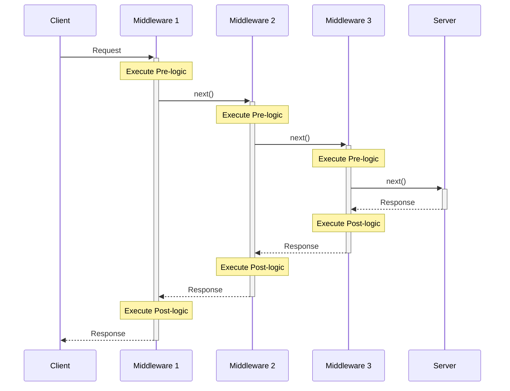

# Middleware in ASP.NET Core

## Definition
Middleware is a component that sits between the web server and the application, handling both incoming requests and outgoing responses. It forms a pipeline through which HTTP requests and responses flow.

## Request Pipeline Flow


## Middleware Characteristics

### 1. Execution Pattern
- Pre-processing (before `next()`)
  ```csharp
  // Logic executed with incoming request
  // before passing to next middleware
  ```
- Delegation (`next()`)
  ```csharp
  await next(context);
  ```
- Post-processing (after `next()`)
  ```csharp
  // Logic executed with outgoing response
  // after next middleware completes
  ```

### 2. Pipeline Order


### Common Use Cases

| Middleware Type | Purpose | Example Operations |
|----------------|---------|-------------------|
| Authentication | Security | Verify user identity |
| Authorization | Access Control | Check permissions |
| Logging | Monitoring | Record request details |
| Error Handling | Exception Management | Catch and process errors |
| CORS | Browser Security | Handle cross-origin requests |
| Response Compression | Performance | Compress response data |

## Key Concepts

1. **Sequential Processing**
   ```mermaid
   graph TD
    A[Request] --> B[Pre-processing]
    B --> C[Next Middleware]
    C --> D[Post-processing]
    D --> E[Response]
   ```

2. **Bidirectional Flow**
- Request: Client → Server (Pre-processing)
- Response: Server → Client (Post-processing)

3. **Order Importance**
```csharp
app.UseExceptionHandler();     // Should be first
app.UseHttpsRedirection();     // Early in pipeline
app.UseAuthentication();       // Before authorization
app.UseAuthorization();        // After authentication
app.UseEndpoints();           // Usually last
```

## Implementation Example

```csharp
public class CustomMiddleware
{
    private readonly RequestDelegate _next;

    public CustomMiddleware(RequestDelegate next)
    {
        _next = next;
    }

    public async Task InvokeAsync(HttpContext context)
    {
        // Pre-processing
        Logger.Log("Processing request");

        // Pass to next middleware
        await _next(context);

        // Post-processing
        Logger.Log("Processing response");
    }
}
```

## Best Practices

1. **Order Consideration**
   - Security middleware early
   - Response-modifying middleware late
   - Exception handling first

2. **Performance Impact**
   - Keep middleware lightweight
   - Only include necessary middleware
   - Consider order for performance

3. **Error Handling**
   - Include proper error handling
   - Log middleware exceptions
   - Maintain pipeline integrity

---
**Note**: The correct ordering of middleware is crucial for application functionality and security. Incorrect ordering can lead to security vulnerabilities or pipeline short-circuits.
