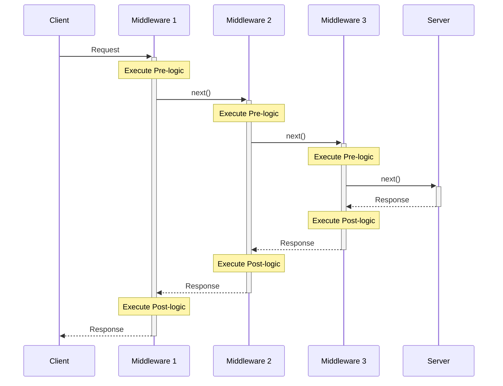
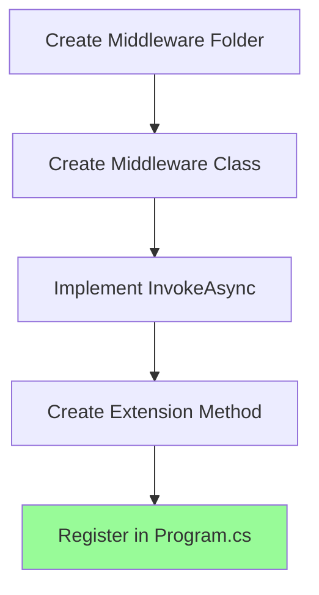
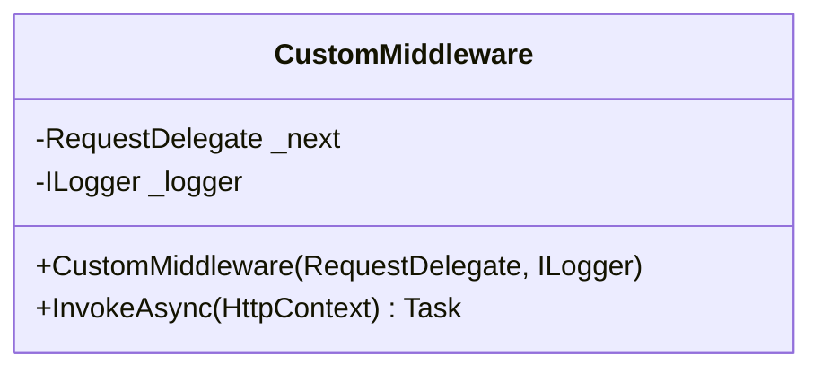
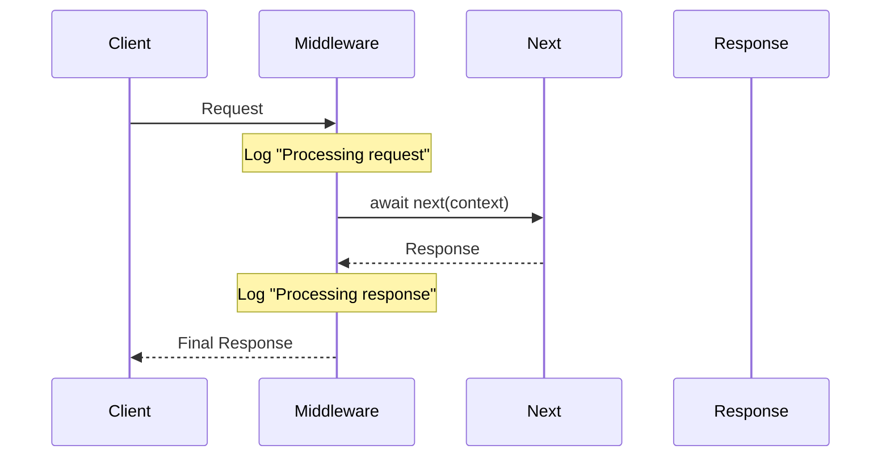
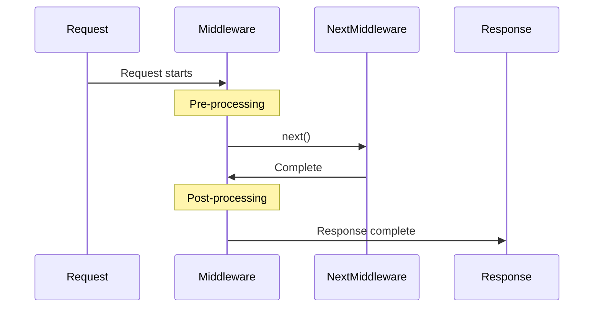

# Middleware in ASP.NET Core

## Definition
Middleware is a component that sits between the web server and the application, handling both incoming requests and outgoing responses. It forms a pipeline through which HTTP requests and responses flow.

## Request Pipeline Flow


## Middleware Characteristics

### 1. Execution Pattern
- Pre-processing (before `next()`)
  ```csharp
  // Logic executed with incoming request
  // before passing to next middleware
  ```
- Delegation (`next()`)
  ```csharp
  await next(context);
  ```
- Post-processing (after `next()`)
  ```csharp
  // Logic executed with outgoing response
  // after next middleware completes
  ```

### 2. Pipeline Order


### Common Use Cases

| Middleware Type | Purpose | Example Operations |
|----------------|---------|-------------------|
| Authentication | Security | Verify user identity |
| Authorization | Access Control | Check permissions |
| Logging | Monitoring | Record request details |
| Error Handling | Exception Management | Catch and process errors |
| CORS | Browser Security | Handle cross-origin requests |
| Response Compression | Performance | Compress response data |

## Key Concepts

1. **Sequential Processing**
   ```mermaid
   graph TD
    A[Request] --> B[Pre-processing]
    B --> C[Next Middleware]
    C --> D[Post-processing]
    D --> E[Response]
   ```

2. **Bidirectional Flow**
- Request: Client → Server (Pre-processing)
- Response: Server → Client (Post-processing)

3. **Order Importance**
```csharp
app.UseExceptionHandler();     // Should be first
app.UseHttpsRedirection();     // Early in pipeline
app.UseAuthentication();       // Before authorization
app.UseAuthorization();        // After authentication
app.UseEndpoints();           // Usually last
```

## Implementation Example

```csharp
public class CustomMiddleware
{
    private readonly RequestDelegate _next;

    public CustomMiddleware(RequestDelegate next)
    {
        _next = next;
    }

    public async Task InvokeAsync(HttpContext context)
    {
        // Pre-processing
        Logger.Log("Processing request");

        // Pass to next middleware
        await _next(context);

        // Post-processing
        Logger.Log("Processing response");
    }
}
```

## Best Practices

1. **Order Consideration**
   - Security middleware early
   - Response-modifying middleware late
   - Exception handling first

2. **Performance Impact**
   - Keep middleware lightweight
   - Only include necessary middleware
   - Consider order for performance

3. **Error Handling**
   - Include proper error handling
   - Log middleware exceptions
   - Maintain pipeline integrity

---
**Note**: The correct ordering of middleware is crucial for application functionality and security. Incorrect ordering can lead to security vulnerabilities or pipeline short-circuits.


# Implementing Custom Middleware

## Approaches to Custom Middleware

### 1. Inline Middleware (Not Recommended)
```csharp
// Program.cs
var logger = app.Logger;
app.Use(async (context, next) => {
    logger.LogInformation("Processing request");
    await next(context);
    logger.LogInformation("Processing response");
});
```

### 2. Conventional Middleware Class (Recommended)
```csharp
// CustomMiddleware.cs
public class CustomMiddleware
{
    private readonly RequestDelegate _next;
    private readonly ILogger<CustomMiddleware> _logger;

    public CustomMiddleware(RequestDelegate next, ILogger<CustomMiddleware> logger)
    {
        _next = next;
        _logger = logger;
    }

    public async Task InvokeAsync(HttpContext context)
    {
        _logger.LogInformation("Processing request");
        await _next(context);
        _logger.LogInformation("Processing response");
    }
}

// Usage in Program.cs
app.UseMiddleware<CustomMiddleware>();
```

### 3. Extension Method Approach (Best Practice)
```csharp
// CustomMiddlewareExtensions.cs
public static class CustomMiddlewareExtensions
{
    public static IApplicationBuilder UseCustomMiddleware(
        this IApplicationBuilder builder)
    {
        return builder.UseMiddleware<CustomMiddleware>();
    }
}

// Usage in Program.cs
app.UseCustomMiddleware();
```

## Project Structure
```
YourProject/
├── Middlewares/
│   ├── CustomMiddleware.cs
│   └── CustomMiddlewareExtensions.cs
└── Program.cs
```

## Implementation Flow


## Components Breakdown

### 1. Middleware Class


### 2. Extension Method


## Comparison of Approaches

| Approach | Pros | Cons |
|----------|------|------|
| Inline | Quick to implement | Hard to maintain, Limited reusability |
| Class-based | Organized, Reusable | More files to manage |
| Extension Method | Clean syntax, Best practice | Additional setup required |

## Best Practices

1. **File Organization**
   - Keep middleware in dedicated folder
   - Use consistent naming conventions
   - Separate class and extension files

2. **Implementation**
   - Use dependency injection
   - Implement async patterns
   - Handle exceptions properly

3. **Naming Conventions**
   ```
   CustomMiddleware.cs           // Main middleware class
   CustomMiddlewareExtensions.cs // Extension methods
   UseCustomMiddleware()         // Extension method name
   ```

## Execution Flow Example


## Registration in Pipeline
```csharp
public void Configure(IApplicationBuilder app)
{
    // Built-in middleware
    app.UseHttpsRedirection();
    
    // Custom middleware
    app.UseCustomMiddleware();
    
    // More built-in middleware
    app.UseAuthorization();
}
```

---
**Note**: Custom middleware should be placed in the pipeline considering its dependencies and the order of execution needed for your application's requirements.


# HttpContext and Next Delegate

## HttpContext Overview
- Contains all information about the HTTP request
- Provides access to:
  - Request details
  - Response details
  - User information
  - Connection details

## Next Delegate (RequestDelegate)
- Represents the next middleware in the pipeline
- Used to pass control to the next middleware
- Important characteristics:
  - Code before `next()` executes during request
  - Code after `next()` executes during response
  - If `next()` isn't called, pipeline stops at current middleware

## Implementation in Custom Middleware

```csharp
public class CustomMiddleware
{
    private readonly RequestDelegate _next;
    private readonly ILogger<CustomMiddleware> _logger;

    // Constructor receives next delegate through DI
    public CustomMiddleware(RequestDelegate next, ILogger<CustomMiddleware> logger)
    {
        _next = next;
        _logger = logger;
    }

    // Method handling the request/response
    public async Task InvokeAsync(HttpContext context)
    {
        _logger.LogInformation("Processing request");
        await _next(context);  // Pass to next middleware
        _logger.LogInformation("Processing response");
    }
}
```

## Request Flow


---
**Note**: Understanding these concepts is essential for building custom middleware as they form the backbone of the ASP.NET Core request pipeline.
